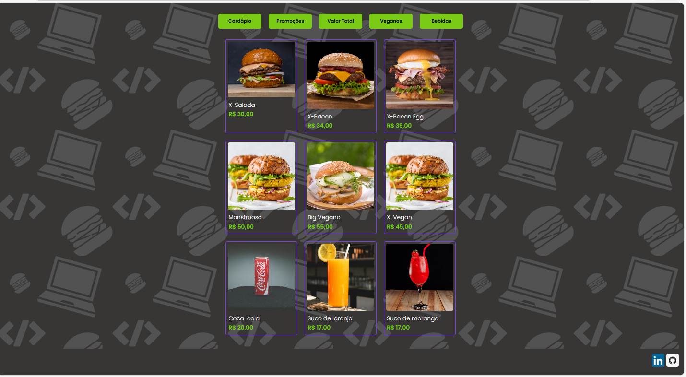
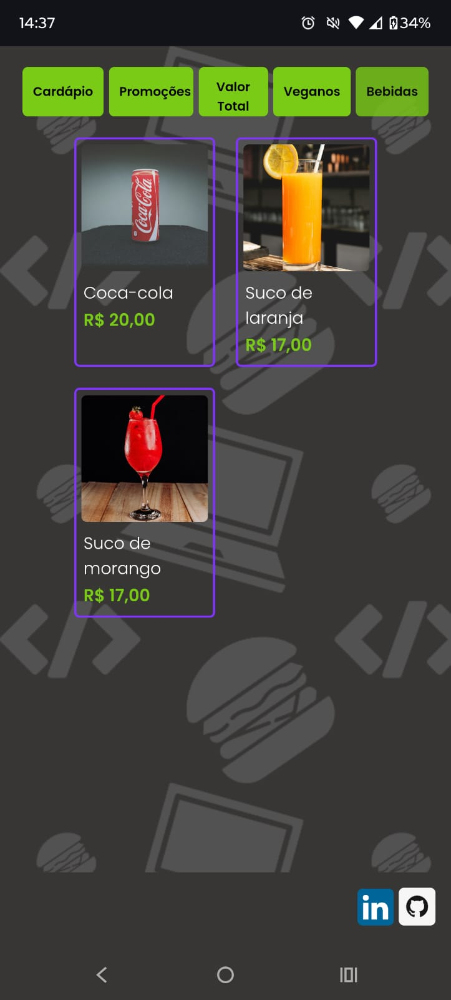

<h1 align="center">🍔 Burguer</h1>

  
  
  
  
  

## 📌 Descrição

Este projeto foi desenvolvido com **HTML, CSS e JavaScript puro**, com foco no fortalecimento da lógica de programação e manipulação de dados.
A aplicação simula um **menu interativo de hamburgueria**, permitindo aplicar filtros, descontos e cálculos dinâmicos sobre os produtos.

## 🚀 Funcionalidades

- ✅ Exibir todos os produtos
- ✅ Aplicar desconto de 10%
- ✅ Calcular valor total com e sem desconto
- ✅ Filtrar produtos veganos
- ✅ Filtrar bebidas
- ✅ Renderização dinâmica no DOM

## 🛠️ Conceitos Praticados

- Manipulação de DOM
- Template Strings
- Spread Operator
- Métodos de Array:
  - `forEach`
  - `map`
  - `reduce`
  - `filter`
- Organização de código
- Eventos no JavaScript

## 🌐 Acesse o Projeto

https://jonathamcarvalho.github.io/Hamburgueria/

## 📸 Preview

## Desktop

  

## Mobile

  

